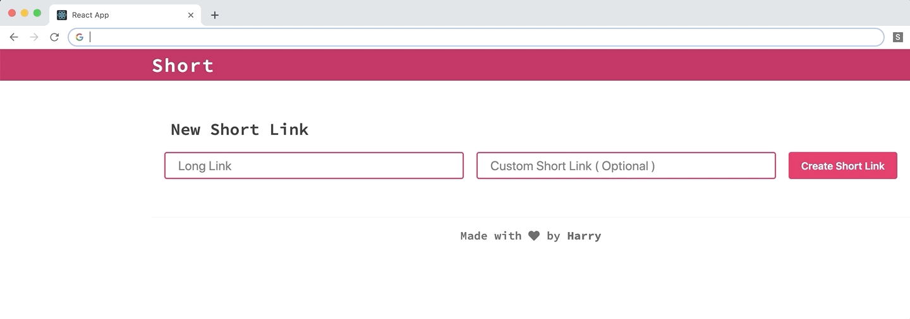
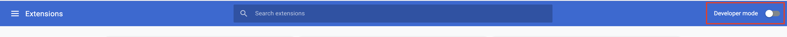
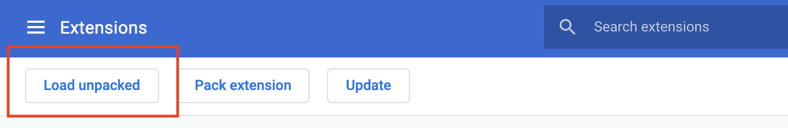
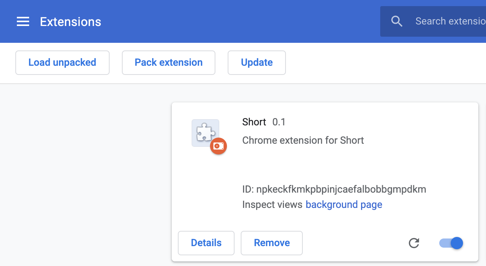

# Short Ext


Get it from [Chrome Web Store](https://chrome.google.com/webstore/detail/short/hoobjcdfefnngjeepgjkiojpcicciihc)

## Preview


## Prerequisites
- yarn v1.17.3
- node v12.3.1

## Getting Started
### Build
```
npm install
npm run extension
```

### Install
1. Navigate to `chrome://extensions/` in Google Chrome.
2. Turn on `developer mode`.

3. Click on `Load unpacked`.

4. Select `build` directory.
5. **Short** should now up in extension list.


## Author
Harry Liu - [byliuyang](https://github.com/byliuyang)

## License
This project is maintained under MIT license
